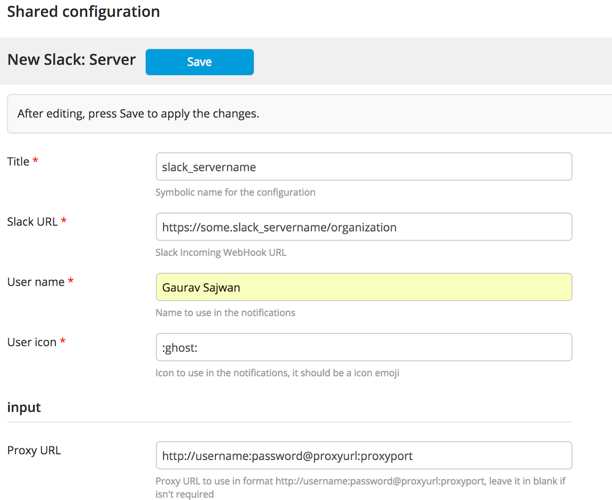
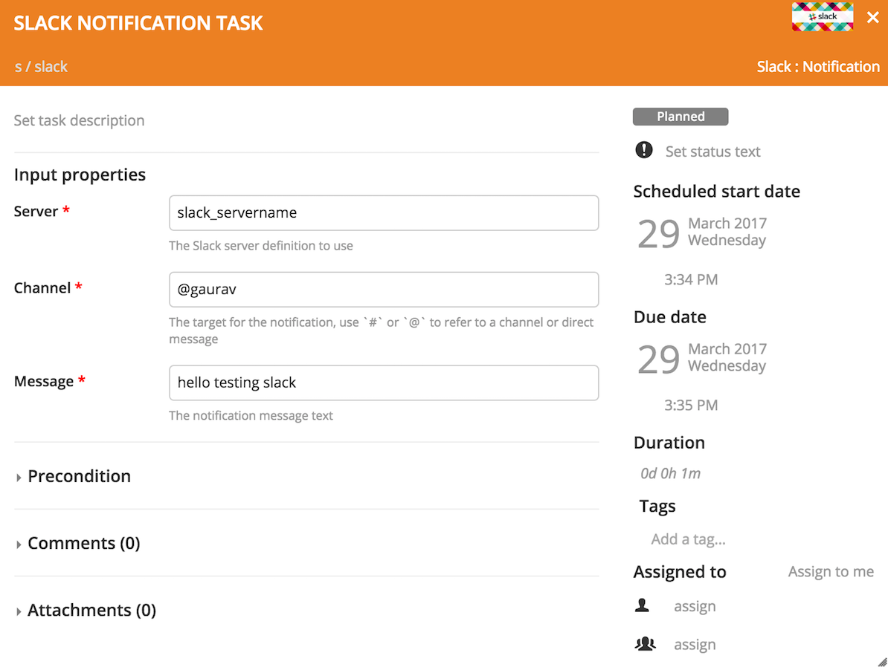

# XL Release Mattermost Plugin

[comment]: # 
[comment]: # 
[comment]: # 
[comment]: # 

## Preface
This document describes the functionality provided by the `xlr-mattermost-plugin`. This plugin was forked from the [xlr-slack-plugin](https://github.com/xebialabs/xlr-slack-plugin) which seems to be deprecated.

## Overview
This plugin provides a notification task to send Mattermost messages to a channel.
It's based on Incoming Webhooks integration, which provides a URL within an authorization token ready to POST messages.

[comment]: # See [Slack Incoming Webhooks](https://api.slack.com/incoming-webhooks) documentation for background information on post messages from external sources into Slack.

## Installation
Copy the plugin JAR file into the `SERVER_HOME/plugins` directory of XL Release.

## Configuration
This configuration allows you to connect to multiple servers or connect to just one.
Before using the Mattermost notification task, it's needed to setup a Mattermost server definition within the following information:

- **Title:** Name of the Mattermost server definition.
- **Mattermost URL:** Tokenized URL provided by the Incoming WebHook integration.

## Available Tasks
The available tasks for interfacing with Mattermost. These tasks utilize the REST API and the provided Authentication Configuration.

## Notification task
The Mattermost notification task needs the next information:

- **Server:** The Mattermost server definition to use.
- **Message:** The notification message text, it could be [formatted](https://api.slack.com/docs/formatting).

--- 
## References:
* [Slack Rest API](https://api.slack.com/web)

